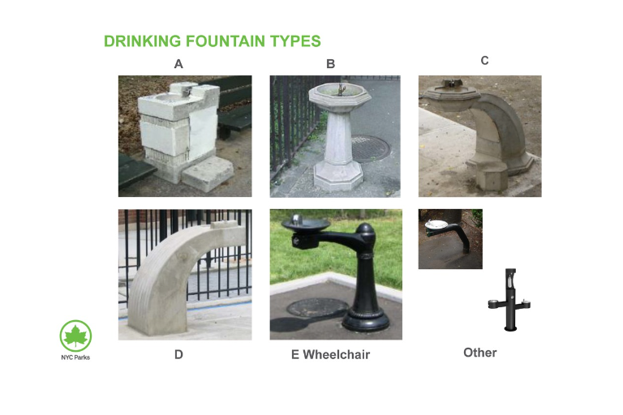

# NYC-Parks-Drinking-Fountains-Analysis

## Introduction

This project analyzes the NYC Parks Drinking Fountains dataset to gain insights into the distribution and characteristics of drinking fountains across different boroughs in New York City.

## Data Source

The dataset was obtained from [NYC OpenData](https://data.cityofnewyork.us/Recreation/NYC-Parks-Drinking-Fountains/qnv7-p7a2/about_data).

## Pandas Analysis (From Jupyter Notebook)
[NYC Parks Drinking Fountains Analysis.ipynb](NYC%20Parks%20Drinking%20Fountains%20Analysis.ipynb)

The analysis involved cleaning the dataset to remove inconsistencies and missing values. Some key findings from the analysis include:

- There is a significant variation in the distribution of drinking fountains across different boroughs, with Brooklyn having the highest number of fountains and Staten Island having the lowest.
- The majority of drinking fountains in NYC parks are painted, indicating that they have been maintained or refurbished.
- The most common type of drinking fountain observed is Type A, based on the provided data.
  

## SQL Analysis 
[NYC_Fountains_Analysis.sql](NYC_Fountains_Analysis.sql)
- Added SQL queries to perform advanced analysis, such as calculating fountain density by borough, finding nearest fountains to a given location, and ranking fountains based on fountain count.
- Demonstrated proficiency in PostgreSQL, including the use of window functions, subqueries, and conditional aggregation.
  
## Tableau Dashboard

A Tableau dashboard was created to visualize the distribution of drinking fountains across different boroughs and explore various characteristics of the fountains. The dashboard includes:

- Location map of drinking fountains plotted using latitude and longitude coordinates.
- Bar chart showing the number of drinking fountains in each borough.
- Bar chart showing the number of painted and unpainted drinking fountains in each borough.
- Bar chart showing the number of fountain types in each borough.

Explore the Tableau dashboard [here](https://public.tableau.com/views/NYCParksDrinkingFountainsAnalysisDashboard/NYCParksDrinkingFountainsAnalysisDashboard?:language=en-US&:sid=&:display_count=n&:origin=viz_share_link).
